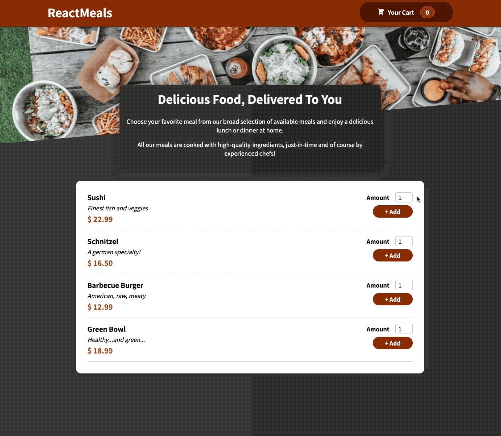

## 🍔 Mini Food Order App

[Udemy Lecture URL](https://www.udemy.com/course/best-react/)

Udemy 강의 (상단 URL) 에서 "Section 11: Practice Project: Building a Food Order App" 을 따라 만들어 보며 리액트의 기술을 학습, 재복습 해보는 시간을 가졌습니다.

## 🎨 적용한 React 기술

- useReducer

- Context API

- React Portal

- useRef, forwardRef

## ⛱ 동작 이미지

